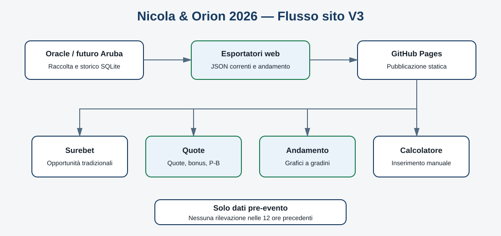

# Nicola & Orion 2026 — Sito statistiche V3

## Struttura

Il menu comprende Home, Surebet, Quote, Andamento e Calcolatore. Le precedenti pagine Bonus e Storico reindirizzano a Quote, preservando i vecchi collegamenti.

La pagina Quote riunisce quote bookmaker, coperture bonus e Surebet Punta-Banca. Offre filtri multipli per operatore e ordinamento per quota, ROI, data o liquidità.

La pagina Andamento carica prima il leggero `data/andamento/indice.json` e poi soltanto il file dell'evento selezionato. Il grafico a gradini distingue PUNTA e BANCA e confronta più operatori. Una serie significativa possiede almeno sei intervalli, equivalenti ad almeno cinque variazioni; le serie minori sono facoltative.

Il sito mostra solo informazioni pre-evento: la raccolta termina almeno dodici ore prima dell'orario ufficiale e non contiene dati live.
